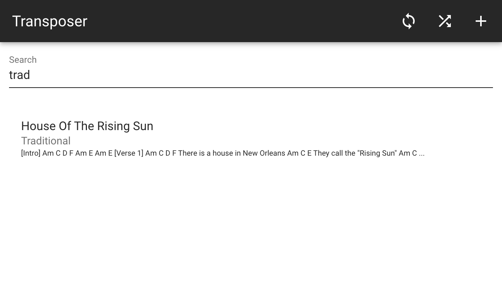

# Transposer

An Offline First app that allows the storage of song chords/lyrics for the budding musician. The data is stored in a PouchDB database in the browser and can be optionally replicated with a remote CouchDB or Cloudant service.

The songs can be shuffled, searched and retrieved and optionally transposed up or down 12 increments.




## Running Transposer

You can simply visit the website here https://glynnbird.github.io/transposer/

or clone this repo and run:

```
python -m SimpleHTTPServer 8000
```

to run locally.

Either way, your songs are stored in the local browser using PouchDB. They are only synced to a remote CouchDB or Cloudant service if you configure it to do so.