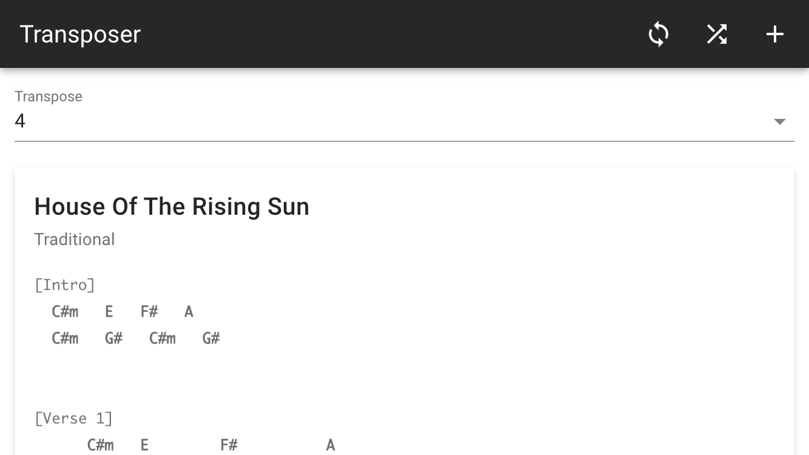

# Transposer

An Offline First app that allows the storage of song chords/lyrics for the budding musician. The data is stored in a PouchDB database in the browser and can be optionally replicated with a remote CouchDB or Cloudant service.

The songs can be shuffled, searched and retrieved and optionally transposed up or down 12 increments.

See it in action here https://glynnbird.github.io/transposer/